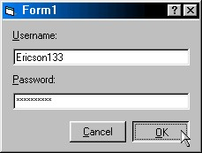

<div align="center">

## Real C\+\+ Buttons \(Fixed\)


</div>

### Description

Notice: THIS CODE HAS BEEN FIXED! PLEASE READ THE COMMENTS AT THE BOTTOM OF THE PAGE TO SEE WHAT WAS WRONG BEFORE.

Create real C++ style command buttons with ONE line of code!!! You can use this code on any of your commands buttons. You will loose any images and the BackColor of the button, but that really doesn't matter because you can 'paint' images onto the button using the API. Make sure you set the style property to 'Graphical' or this will not work!. OK here is how it works. You see, by default Visual Basic's command buttons are drawn with the 'Default Push Button' style, which makes them flat and ugly when pushed. But when you set the style to 'Graphical' its really just a C++ button with a single pixel outline drawn around it. This code basically just stops the button from drawing that line to create a sunken style button. This code is not compatible with Visual Basic 4.0/32 because its buttons don't have the style property.

However, in Visual Basic 4.0 you can apply the code to an option button and it will appear as a C++ push button (they both have the same basic events and properties: Click, MouseMove, etc...) which is a 'rigged' kind of way of getting it in to Visual Basic 4.0...hehe. I wrote this code because I got tired of all the people trying to create C++ style buttons with CreateWindowEx and Message Hooks, and all that other difficult stuff.
 
### More Info
 
You will need the hWnd of the command button.

Set the buttons style property to 'Graphical' first!!!

You will loose the backcolor and images.


<span>             |<span>
---                |---
**Submitted On**   |
**By**             |[Randy Mcdowell \(Nebuland Technologies\)](https://github.com/Planet-Source-Code/PSCIndex/blob/master/ByAuthor/randy-mcdowell-nebuland-technologies.md)
**Level**          |Advanced
**User Rating**    |4.6 (37 globes from 8 users)
**Compatibility**  |VB 4\.0 \(32\-bit\), VB 5\.0, VB 6\.0
**Category**       |[Custom Controls/ Forms/  Menus](https://github.com/Planet-Source-Code/PSCIndex/blob/master/ByCategory/custom-controls-forms-menus__1-4.md)
**World**          |[Visual Basic](https://github.com/Planet-Source-Code/PSCIndex/blob/master/ByWorld/visual-basic.md)
**Archive File**   |[](https://github.com/Planet-Source-Code/randy-mcdowell-nebuland-technologies-real-c-buttons-fixed__1-5983/archive/master.zip)

### API Declarations

```
Private Declare Function SendMessage Lib "User32" Alias "SendMessageA" (ByVal hWnd As Long, ByVal wMsg As
Long, ByVal wParam As Long, lParam As Any) As Long
```


### Source Code

```
Sub Form_Load()
 ' Command1.Style = 1 ' Graphical
 SendMessage Command1.hWnd, &HF4&, &H0&, 0&
End Sub
```

